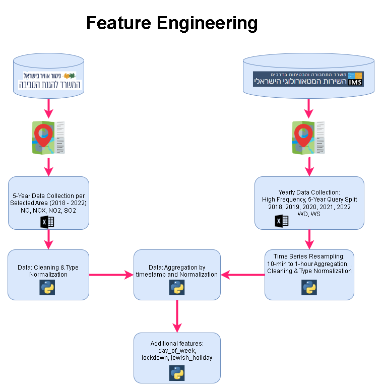

### Students: 
[Andrey Dodon](https://www.kaggle.com/andreydodon) 
[Doron Tzur](https://www.kaggle.com/andreydodon) 

# Introduction

In the course of our postgraduate pursuit, we undertook a project labelled "Evaluating the COVID-19 
Influence on Air Quality in Israel: A Machine Learning Perspective." The inspiration for this project 
was derived from a previously published investigation that delved into a related subject - 
[Assessing the COVID-19 Impact on Air Quality: A Machine Learning Approach](https://agupubs.onlinelibrary.wiley.com/doi/full/10.1029/2020GL091202). 
Numerous research undertakings globally have probed into the consequences of the lockdown measures enforced 
in 2020 due to the outbreak of the Corona Virus disease on air quality. Although a common consensus is 
reached on the diminution of pollution, there persists a dispute over the most dependable methodology 
for gauging the reduction in pollution.

In our research, we employed machine learning models built on the Gradient Boosting Machine algorithm 
to measure the impact of the pandemic on the quality of air in various districts of Israel. We initially 
validated the precision of our forecasts by performing cross-validation over the five-year span preceding 
the lockdown.

Following this, we quantified the shifts in pollution levels during the period of the lockdown. 
Our scrutiny divulged that districts with high vehicular congestion registered the most dramatic decrease 
in pollution. As the restrictions were partially revoked, the pollution concentrations started reverting 
to pre-pandemic figures. We buttressed our estimation of the fall in pollution by evaluating the confidence 
of our predictions.

Our objective through this project was to augment the understanding of how the COVID-19 pandemic 
has influenced the quality of air in Israel. By leveraging machine learning techniques, we offered 
valuable insights into the patterns and shifts of pollution during the lockdown phase. Our deductions 
underscore the significance of executing efficient strategies to curb pollution, especially in regions 
with heavy traffic. Moreover, our research accentuates the potential of machine learning algorithms in 
analysing and forecasting the dynamics of air quality amid unprecedented occurrences such as a pandemic.

# Methodology
Our research methodology employed machine learning models, specifically the Gradient Boosting Machine (GBM) 
algorithm, to examine the pandemic's impact on air quality across various districts in Israel. The model 
was initially tested for accuracy through cross-validation across a three-year span before the lockdown.

Here is a detailed breakdown of the machine learning model parameters and methods:

* The model was built using a Gradient Boosting Classifier.
* The model construction involved 100 decision trees (parameter n_estimators=100), a learning rate of 0.1 
(parameter learning_rate=0.1), and a maximum tree depth of 2 (parameter max_depth=2).
* Each decision tree was trained on a random sample consisting of 80% of the data (parameter subsample=0.8). 
This subsampling approach adds an element of randomness to model training, aiding in the prevention of 
overfitting.
* We employed 5-fold cross-validation to assess the model's performance. This technique divides the dataset 
into five subsets, using four for training and the remaining one for validation. The process is repeated 
five times, ensuring each subset is used once for validation. Cross-validation offers a more reliable measure 
of the model's performance and its ability to generalize to unseen data.

Following the model's validation, we quantified the changes in pollution levels during the lockdown period. 
Our analysis revealed that districts with high vehicular congestion experienced the most significant reduction 
in pollution. As lockdown restrictions were gradually lifted, pollution levels began to approach pre-pandemic 
figures. We reinforced our estimates of the pollution decrease by evaluating the confidence of our predictions.

The primary objective of this project was to enhance our understanding of the COVID-19 pandemic's impact on air 
quality in Israel. Leveraging machine learning techniques allowed us to gain valuable insights into pollution 
patterns and shifts during the lockdown. Our findings emphasize the importance of implementing effective 
strategies to mitigate pollution, particularly in heavily trafficked areas. Furthermore, our research highlights 
the potential of machine learning algorithms in analyzing and predicting air quality dynamics during 
extraordinary events such as a pandemic.

# Dataset

The dataset we're using comprises data from multiple sources. However, we noticed inconsistencies 
across various data fields, leading us to select specific data sources. We chose to use data from the 
Ministry of Environmental Protection of Israel and the Meteorological Service of Israel. Although we 
also considered the databank of the Israel Central Bureau of Statistics, we decided against it due to the 
significant costs of data cleaning and engineering.

From the Ministry of Environmental Protection, we gathered key pollution measurements such as 
NO, NOX, NO2, and SO2. From the Meteorological Service of Israel, we sourced the WS, WD, and RH features, 
which have been highly recommended in prior studies. We also incorporated categorical features like the day 
of the week, area, and lockdown status into our dataset.

# Features:
* **NO:** Stands for Nitric Oxide, a colorless and poisonous gas that is a primary contributor to 
atmospheric pollution. It's primarily produced from the emissions of vehicles and power plants.

* **NOX:** This is a generic term for the nitrogen oxides that are most relevant for air pollution, 
namely nitric oxide (NO) and nitrogen dioxide (NO2). These gases contribute to the formation of smog and 
acid rain, as well as affecting tropospheric ozone.

* **NO2:** Nitrogen Dioxide is a reddish-brown gas with a characteristic sharp, biting odor and is a 
prominent air pollutant. It is produced when nitric oxide (NO) combines with oxygen (O2).

* **SO2:** Sulfur Dioxide is a colorless gas with a strong, choking odor. It is released from the burning 
of fossil fuels (coal and oil) and the smelting of mineral ores that contain sulfur. High levels of sulfur 
dioxide can cause inflammation and irritation of the respiratory system, especially during heavy physical 
activity.

* **WS:** Wind Speed is a measurement of how fast the air is moving in a certain area. It's an important 
factor in weather forecasts and climatic studies. It can also affect the dispersion of pollutants in the 
atmosphere.

* **WD:** Wind Direction is the direction from which the wind is coming. It's usually reported in cardinal 
directions or in degrees. For example, a wind coming from the north is a north wind, and a wind coming from 
the west is a west wind.

* **RH:** Relative Humidity is the amount of moisture in the air compared to the maximum amount of moisture 
the air could hold at the same temperature. It's expressed as a percentage. High relative humidity can enhance 
the formation and persistence of certain air pollutants.

* **Lockdown:** This is a binary feature representing whether a COVID-19 lockdown was in effect on a 
particular day. A value of 1 indicates that a lockdown was in effect, while a 0 indicates no lockdown. 
This feature is crucial in this analysis as it allows us to distinguish between periods of normal activity 
and those with reduced human activity due to lockdowns. It helps us understand the impact of lockdowns on the 
levels of air pollutants and overall air quality.

* **Area:** This categorical feature represents the geographic region where the air quality measurements 
were taken. Different areas can have varying levels of pollutants due to factors such as population density, 
industrial activity, vehicular traffic, among others. 

* **Day of Week:** This is a categorical feature that indicates the day of the week when the measurements 
were taken. It is represented as an integer, where 0 stands for Monday and 6 stands for Sunday. Including 
this feature allows us to capture any weekly patterns in air quality. 

## Explanatory

Each of the features mentioned - **NO**, **NOX**, **NO2**, **SO2**, **WS**, **WD**, and **RH** - can provide 
valuable insights in the context of an air quality analysis. Here's why:

* **NO, NOX, NO2, SO2:** These are key pollutants that directly impact air quality. During COVID-19 lockdowns, 
many anthropogenic activities, such as driving vehicles or operating industrial plants, were significantly reduced. 
This potentially leads to a reduction in the emission of these pollutants. By tracking the levels of these 
pollutants, we can quantify the impact of lockdown measures on air quality. Machine learning can help identify 
patterns and correlations, predict future pollution levels, and even identify the sources of these pollutants.

* **WS (Wind Speed):** Wind can disperse or accumulate air pollutants, affecting air quality locally and 
regionally. During lockdowns, any changes in air pollution levels might be influenced not only by reduced human 
activities but also by weather conditions such as wind speed. ML can help in understanding the role of wind 
speed in the dispersion of pollutants and predicting how changes in wind patterns might affect future air 
quality.

* **WD (Wind Direction):** Similar to wind speed, wind direction can significantly influence where pollutants 
are carried, potentially impacting air quality in different areas. Machine learning models can help analyze 
the impact of wind direction on pollutant distribution during the lockdown period.

* **RH (Relative Humidity):** Moisture in the air can react with certain pollutants, potentially leading to 
secondary pollutants or exacerbating pollution levels. High humidity can also trap pollutants close to the 
ground. Incorporating RH into ML models allows for a more comprehensive understanding of air quality dynamics 
during the lockdown.

* **Lockdown:** This is a binary variable indicating whether a lockdown was in effect on a given day. The 
lockdown measures imposed due to COVID-19 had a profound effect on human behavior, leading to a dramatic 
reduction in anthropogenic activities such as vehicular movement, industrial operations, and other economic 
activities. This abrupt halt or scale-down of activities resulted in a significant decrease in emissions of 
various pollutants. Thus, the lockdown variable serves as an essential indicator of the periods during which 
these extraordinary conditions were in effect. By incorporating this variable into our model, we can directly 
evaluate the changes in air quality attributable to the lockdown periods versus the non-lockdown periods.

* **Area:** This categorical variable represents different geographic regions where the measurements were taken. 
Different regions might have varying levels of pollutants due to differences in population density, industrial 
activities, vehicular movement, and other factors. By including the 'area' feature in our model, we can capture 
these spatial differences in air quality and investigate whether the impact of the lockdown varied across 
different regions.

* **Day of Week:** This categorical variable represents the day of the week for each observation. 
Human activities and thus air pollution levels can exhibit weekly cycles. For instance, traffic volume and 
industrial activities might be lower on weekends compared to weekdays, leading to lower emissions. 
By including this feature, our model can capture such weekly patterns in air pollution.

# Future Work
Going forward, we aim to improve our model with additional data and potentially by using more advanced 
machine learning techniques. We also aim to assess the impact of post-lockdown activities on the air 
quality and to draw insights that can help in policymaking to maintain the improved air quality levels 
witnessed during the lockdowns.

We believe that the work presented here provides a promising direction for future research into the impact 
of extraordinary events, such as pandemics or economic recessions, on the environment. By understanding 
these impacts, we can find ways to mitigate the negative effects and improve the quality of life for all 
residents.
